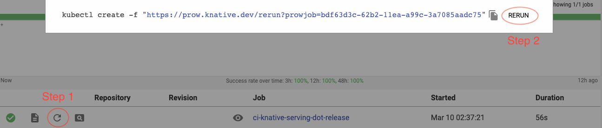

# Creating a new Knative release locally

**Note:** This should not be used for official releases.

This is intended for debugging and testing purposes.

## The release.sh script

The `release.sh` script in the `hack` directory automates the creation of
Knative releases, either nightly or versioned ones.

By default, the script creates a nightly release but does not publish it
anywhere.

## Common flags for cutting releases

The following flags affect the behavior of the script, no matter the type of the
release.

- `--skip-tests` Do not run tests before building the release. Otherwise, build,
  unit and end-to-end tests are run and they all must pass for the release to be
  built.
- `--tag-release`, `--notag-release` Tag (or not) the generated images with
  either `vYYYYMMDD-<commit_short_hash>` (for nightly releases) or `vX.Y.Z` for
  versioned releases. _For versioned releases, a tag is always added (i.e.,
  these flags are ignored)._
- `--release-gcs` Defines the GCS bucket where the manifests will be stored. By
  default, this is `knative-nightly/MODULE` (MODULE is a Knative module name,
  e.g. `serving` or `eventing`). This flag is ignored if the release is not
  being published.
- `--release-gcr` Defines the GCR where the images will be stored. By default,
  this is `gcr.io/knative-nightly`. This flag is ignored if the release is not
  being published.
- `--release-dir` Defines the directory where the manifests will be stored. It
  is mutually exclusive to `release-gcs`. If `--nopublish` is used, and
  `--release-dir` is not passed, the directory defaults to the repository root.
- `--publish`, `--nopublish` Whether the generated images should be published to
  a GCR, and the generated manifests written to a GCS bucket or not. If yes, the
  `--release-gcs` and `--release-gcr` flags can be used to change the default
  values of the GCR/GCS used. If no, the images will be pushed to the `ko.local`
  registry, and the manifests written to the local disk only (in the repository
  root directory).

## Creating nightly releases

Nightly releases are built against the current git tree. The behavior of the
script is defined by the common flags. You must have write access to the GCR and
GCS bucket the release will be pushed to, unless `--nopublish` is used.

Examples:

```sh
# Create and publish a nightly, tagged release.
./hack/release.sh --publish --tag-release

# Create release, but don't test, publish or tag it.
./hack/release.sh --skip-tests --nopublish --notag-release
```

## Creating versioned releases

To specify a versioned release to be cut, you must use the `--version` flag.
Versioned releases are usually built against a branch in the Knative repository,
specified by the `--branch` flag.

- `--version` Defines the version of the release, and must be in the form
  `X.Y.Z`, where X, Y and Z are numbers.
- `--branch` Defines the branch in Knative repository from which the release
  will be built. If not passed, the `master` branch at HEAD will be used. This
  branch must be created before the script is executed, and must be in the form
  `release-X.Y`, where X and Y must match the numbers used in the version passed
  in the `--version` flag. This flag has no effect unless `--version` is also
  passed.
- `--release-notes` Points to a markdown file containing a description of the
  release. This is optional but highly recommended. It has no effect unless
  `--version` is also passed.
- `--github-token` Points to a text file containing the GitHub token to be used
  for authentication when publishing the release to GitHub. If this flag is not
  used and this is the first time you're publishing a versioned release, you'll
  be prompted for your GitHub username, password, and possibly 2-factor
  authentication challenge (you must be a Knative admin to have the required
  publishing permissions).

The release will be published in the _Releases_ page of the Knative repository,
with the title _Knative MODULE release vX.Y.Z_ and the given release notes. It
will also be tagged _vX.Y.Z_ (both on GitHub and as a git annotated tag).

Example:

```sh
# Create and publish a versioned release of Knative Serving.
./hack/release.sh --publish --tag-release \
  --release-gcr gcr.io/knative-releases \
  --release-gcs knative-releases/serving \
  --version 0.3.0 \
  --branch release-0.3 \
  --release-notes $HOME/docs/release-notes-0.3.md
```

## Creating incremental build releases ("dot releases")

An incremental build release (aka "dot release") is a versioned release built
automatically based on changes in the latest release branch, with the build
number increased.

For example, if the latest release on release branch `release-0.2` is `v0.2.1`,
creating an incremental build release will result in `v0.2.2`.

To specify an incremental build release to be cut, you must use the
`--dot-release` flag. The latest branch and release version will be
automatically detected and used.

_Note 1: when using the `--dot-release` flag, the flags `--nopublish` and
`--notag-release` have no effect. The release is always tagged and published._

_Note 2: if the release branch has no new commits since its last release was
cut, the script successfully exits with a warning, and no release will be
created._

The following flags are useful when creating incremental build releases:

- `--branch` Restricts the incremental build release to the given branch. If not
  passed, the latest branch will be automatically detected and used.
- `--release-notes` Points to a markdown file containing a description of the
  release. If not passed, the notes will be copied from the previous release.
- `--github-token` Points to a text file containing the GitHub token to be used
  for authentication when publishing the release to GitHub. If this flag is not
  used and this is the first time you're publishing a versioned release, you'll
  be prompted for your GitHub username, password, and possibly 2-factor
  authentication challenge (you must be a Knative admin to have the required
  publishing permissions).

Like any regular versioned release, an incremental build release is published in
the _Releases_ page of the Knative repository.

Example:

```sh
# Create and publish a new dot release for Knative Serving.
./hack/release.sh \
  --dot-release \
  --release-gcr gcr.io/knative-releases \
  --release-gcs knative-releases/serving
```

# Creating a new Knative release using Prow

**Note:** The user starting the release job must have privileged access to the
Prow cluster, otherwise the job won't run.

This is the preferred method of manually building a new release.

## Creating an arbitrary release

1. Create a temporary config file like the one below. Replace `MODULE` with the
   right Knative module name (e.g., `serving` or `eventing`). Replace `VERSION`
   with the desired release version number (in the X.Y.Z format), and `BRANCH`
   with the branch version number (in the X.Y format). For the rest of this doc,
   it's assumed this file is `/tmp/release.yaml`.

   ```
   periodics:
     knative/MODULE:
       - auto-release: true
         cron: "* * * * *"
         args:
         - "--publish"
         - "--tag-release"
         - "--github-token /etc/hub-token/token"
         - "--release-gcr gcr.io/knative-releases"
         - "--release-gcs knative-releases/MODULE"
         - "--version VERSION"
         - "--branch release-BRANCH"
   ```

1. Generate the full config from the file above. For the rest of this doc, it's
   assumed this file is `/tmp/release_config.yaml`. Replace `MODULE` with the
   right Knative module name (e.g., `serving` or `eventing`).

   ```
   cd ci/prow
   go run *_config.go \
     --job-filter=ci-knative-MODULE-auto-release \
     --generate-testgrid-config=false \
     --prow-config-output=/tmp/release_config.yaml \
     /tmp/release.yaml
   ```

1. Generate the job config from the full config. For the rest of this doc, it's
   assumed this file is `/tmp/release_job.yaml`. Replace `MODULE` with the right
   Knative module name (e.g., `serving` or `eventing`).

   ```
   bazel run @k8s//prow/cmd/mkpj -- --job=ci-knative-MODULE-auto-release \
     --config-path=/tmp/release_config.yaml \
     > /tmp/release_job.yaml
   ```

1. Start the job on Prow. Make sure you get the credentials first.

   ```
   make get-cluster-credentials
   kubectl apply -f /tmp/release_job.yaml
   ```

1. Monitor the new job through [Prow UI](https://prow.knative.dev).

## Creating a "dot" release on demand

### Option #1: Via Prow UI

**Note:** Has to be a member of
[Knative Milestone Maintainer](https://github.com/orgs/knative/teams/knative-milestone-maintainers)

1. Open a browser, navigate to
   `https://prow.knative.dev/?job=ci-knative-MODULE-[OLD_RELEASE_BRANCH-]dot-release`,
   replace `MODULE` with the right Knative module name (e.g., `serving` or
   `eventing`), and replace `[OLD_RELEASE_BRANCH-]` with the release branch
   number if it's old release branch (e.g., `0.11-`)

1. Pick the first line, click on the refresh button, then click `RERUN` button



### Option #2: ask one of Prow admin

1. Use the `run_job.sh` script to start the dot release job for the module you
   want, like in the example below. Replace `MODULE` with the right Knative
   module name (e.g., `serving` or `eventing`), and replace
   `[OLD_RELEASE_BRANCH-]` with the release branch number if it's old release
   branch (e.g., `0.11-`)

   ```
   cd config/prow
   ./run_job.sh ci-knative-MODULE-[OLD_RELEASE_BRANCH-]dot-release
   ```

1. Monitor the new job through [Prow UI](https://prow.knative.dev).

## Creating a nightly release on demand

### Option #1: Via Prow UI

**Note:** Has to be a member of
[Knative Milestone Maintainer](https://github.com/orgs/knative/teams/knative-milestone-maintainers)

1. Open a browser, navigate to
   `https://prow.knative.dev/?job=ci-knative-MODULE-nightly-release` (Replace
   `Module` with the name of the repo)

1. Pick the first line, click on the refresh button, then click `RERUN` button

### Option #2: ask one of Prow admin

1. Use the `run_job.sh` script to start the nightly release job for the module
   you want, like in the example below. Replace `MODULE` with the right Knative
   module name (e.g., `serving` or `eventing`).

   ```
   cd config/prow
   ./run_job.sh ci-knative-MODULE-nightly-release
   ```

1. Monitor the new job through [Prow UI](https://prow.knative.dev).
