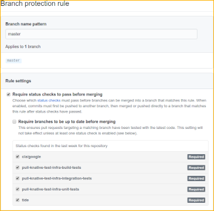

# Prow setup

## Adding new Kubernetes resources

1. Check under [prow/cluster](../config/prow/cluster) and add a new file there
   if not exist.

## Expanding Boskos pool

1. All projects and permissions can be created by running
   `./config/prow/create_boskos_projects.sh`. For example, to create 10 extra
   projects run `./config/prow/create_boskos_projects 10 0X0X0X-0X0X0X-0X0X0X`.
   You will need to substitute the actual billing ID for the second argument. In
   the event the script fails, it should be easy to follow along with in the GUI
   or run on the CLI. Projects are created with a numeric, incremental prefix
   automatically, based on the contents of
   [prow/boskos_resources.yaml](../config/prow/boskos/boskos_resources.yaml),
   which is automatically updated.

1. Increase the compute CPU quota for the project to 200. Go to
   <https://console.cloud.google.com/iam-admin/quotas?service=compute.googleapis.com&metric=CPUs&project=PROJECT_NAME>
   (replace `PROJECT_NAME` with the real project name) and click `Edit Quota`.
   Select at least five regions to increase the quota
   (`us-central1, us-west1, us-east1, europe-west1, asia-east1`). This needs to
   be done manually and should get automatically approved once the request is
   submitted. For the reason, enter _Need more resources for running tests_.

1. Get the commit reviewed.

1. Run `make update-boskos-resource` to update the Boskos resource.

## Setting up Prow for a new organization

1. In GitHub, add the following
   [webhooks](https://developer.github.com/webhooks/) to the org (or repo), in
   `application/json` format and for all events. Ask one of the owners of
   _knative/test-infra_ for the webhook secrets.

   1. `http://prow.knative.dev/hook` (for Prow)
   1. `https://github-dot-knative-tests.appspot.com/webhook` (for Gubernator PR
      Dashboard)

1. Create a team called _Knative Prow Robots_, and make it an Admin of the org
   (or repo).

1. Invite at least [knative-prow-robot](https://github.com/knative-prow-robot)
   for your org. Add it to the robots team you created. For automated releases
   and metrics reporting (e.g., code coverage) you'll need to also add
   [knative-prow-releaser-robot](https://github.com/knative-prow-releaser-robot)
   and [knative-metrics-robot](https://github.com/knative-metrics-robot).

1. Add the org (and/or repo) to the
   [plugins.yaml](../config/prow/core/plugins.yaml) file, at least to the
   `approve` and `plugins` sections. Create a PR with the changes and once it's
   merged ask the [oncall](https://knative.github.io/test-infra/) to update the
   Prow cluster.

## Setting up Prow for a new repo (reviewers assignment and auto merge)

1. Create the appropriate `OWNERS` files (at least one for the root dir).

1. Make sure that _Knative Robots_ is an Admin of the repo.

1. Add the new repo to
   [config_knative.yaml](../config/prow/config_knative.yaml), without any job
   settings. Check the top-level section `presubmits:` and `periodics:` for
   blueprints for what to add. Then run `make config` to regenerate
   [config.yaml](../config/prow/jobs/config.yaml), otherwise the presubmit test
   in test-infra will fail. Create a PR with the changes; once it's merged ask
   the [oncall](https://knative.github.io/test-infra/) to update the Prow
   cluster.

1. Wait a few minutes, check that Prow is working by entering `/woof` as a
   comment in any PR in the new repo.

1. Set **tide** as a required status check for the master branch.

   

### Setting up jobs for a new repo

1. Have the test infrastructure in place (usually this means having at least
   `//test/presubmit-tests.sh` working, and optionally `//hack/release.sh`
   working for automated nightly releases).

1. Merge a pull request that updates
   [config_knative.yaml](../config/prow/config_knative.yaml), the Prow config
   file (usually, copy and update the existing configuration from another
   repository). Run `make config` to regenerate
   [config.yaml](../config/prow/jobs/config.yaml), otherwise the presubmit test
   will fail.

1. Ask the [oncall](https://knative.github.io/test-infra/) to update the Prow
   cluster and TestGrid with the new configs, by running
   `make update-prow-cluster` and `make update-testgrid-config` in
   `config/prow`.

1. Wait a few minutes, enter `/retest` as a comment in any PR in the repo and
   ensure the test jobs are executed.

1. Set the new test jobs as required status checks for the master branch.

   

## Setting up the issue tracker for a repo

If you want Prow to manage the freshness level for Issues and Pull Requests for
a repo (see the
[proposal](https://docs.google.com/document/d/15sqqVxOGAXLNEDFp777NWIpevwrSMYbGQABFLNqiq5Q/edit#heading=h.n8a530nnrb)),
you can set it up by following steps below:

1. Create the labels `lifecycle/stale`, `lifecycle/rotten` and
   `lifecycle/frozen` in the repo.

1. Update
   [`generateIssueTrackerPeriodicJobs()`](https://github.com/knative/test-infra/blob/51c37921d4a7722855fcbb020db3c3865db1cb8f/ci/prow/issue_tracker_config.go#L48)
   in
   [issue_tracker_config.go](../tools/config-generator/issue_tracker_config.go),
   adding the call to generate the config for the new repo.

1. Run `make jobs/config.yaml` to regenerate the Prow config, and submit a PR
   with the two changes. Once the PR is merged, ask the
   [oncall](https://knative.github.io/test-infra/) to update the Prow cluster.
