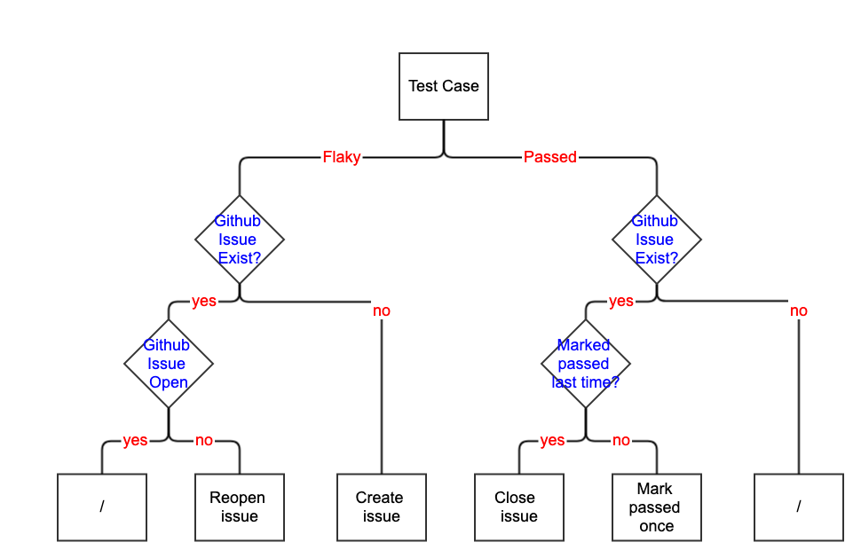

# flaky-test-reporter

flaky-test-reporter is a tool that identifies flaky tests by retrospectively
analyzing continuous flows, tracks flaky tests with Github issues, and sends
summary of flaky tests to Slack channels.

## Basic Usage

Flags for this tool are:

- `--service-account` specifies the path of file containing service account for
  GCS access.
- `--github-account` specifies the path of file containing Github token for
  Github API calls.
- `--slack-account` specifies the path of file containing Slack token for Slack
  web API calls.
- `skip-report` skips all Github/Slack activities. This is used for the purpose
  of data collection.
- `--dry-run` enables dry-run mode.

### IMPORTANT: This tool is _NOT_ intended to run locally, as this could interfere with real Github issues and potentially flood Knative Slack channels

## How To Debug/Verify Changes

For debugging purpose it's highly recommended to start with `--dry-run` flag, by
passing this flag it will only **read** information from GCS/Github, and all the
**writes** of Github/Slack resources are omitted.

### Requirement

- `GCP token`: Create a GCP service account following this
  [instruction](https://cloud.google.com/iam/docs/creating-managing-service-account-keys).
  Download generated json key file and save it securely on your system.
- `Github token`: Create a github token by visiting
  `https://github.com/settings/tokens`, click `Generate new token` and select at
  least `repo:status` and `public_repo` permissions before generate the token.
  Save generated token in a file securely on your system.

### Debug Command

### IMPORTANT: Please DO pass in _--dry-run_ for debugging purpose, as it's good enough for debugging majority of the cases.

Command for debugging:

```
go run [REPO_ROOT]/tools/flaky-test-reporter --service-account "[PATH_OF_GCP_TOKEN]" \
 --github-account "[PATH_OF_GITHUB_TOKEN]" --dry-run
```

## Prow Jobs

1. `ci-knative-flakes-reporter`: triggers this tool at 4:00/5:00AM(Day light
   saving) everyday, which does Github/Slack reporting.
1. `ci-knative-flakes-resultsrecorder`: runs every hour, does only data
   collection part by passing `--skip-report` flag, the data it collected can be
   used like
   [this](https://github.com/knative/test-infra/blob/11c44d69473c167f76da249625d67431b6fe90df/tools/flaky-test-reporter/jsonreport/jsonreport.go#L117)

## Considerations

### Criterias for a test to be considered flaky/passed

This tool scans latest 10 runs. A test is considered flaky if it failed in some
but not all runs. For a test to be considered pass, it has to pass in all runs.
Exceptions are test being ignored or omitted, these may be results of bad runs
or test being omitted for any reason, which is tolerized for up to 2 runs. For
example, if a test passed 8 times and skipped/omitted 2 times, it's still
considered pass.

### Logics for Github issue to be created/closed/reopened

See diagram below



### Github Issue deduplication

Efficient deduplication is crucial for the sustainability of this tool, and this
can be achieved by associate issue with test by unique identifiers. There are 2
identifiers associated with each flaky issue:

- `auto:flaky` label. This tool adds this label when creating issues, and only
  manages issues with this label
- `[DONT_MODIFY_TEST_IDENTIFIER]...[DONT_MODIFY_TEST_IDENTIFIER]` section in
  issue body. Issue with `auto:flaky` label but not this identifier is
  considered abnormal and this tool will stop at information collection phase.

### Minimize Noise

#### Too many flaky tests identified

When there are too many tests found to be flaky, most likely something abnormal
is going on, and we don't want to create Github issues for all of them, or list
all of them in Slack notifications. There are thresholds defined in
[`constants.go`](constants.go), if the flaky rate went over a threshold there
will be only 1 Github issue created, and Slack notification will not list all
flaky tests.

#### Github issue updates

This tool runs everyday, and leaves comments on existing issues everyday, to
avoid flooding the issue with comments, all histories are written into the first
comment by prepending it in a collapsible format, like example below:

```Markdown
PLACEHOLDER for contents of latest results

>Click to see older results
```
