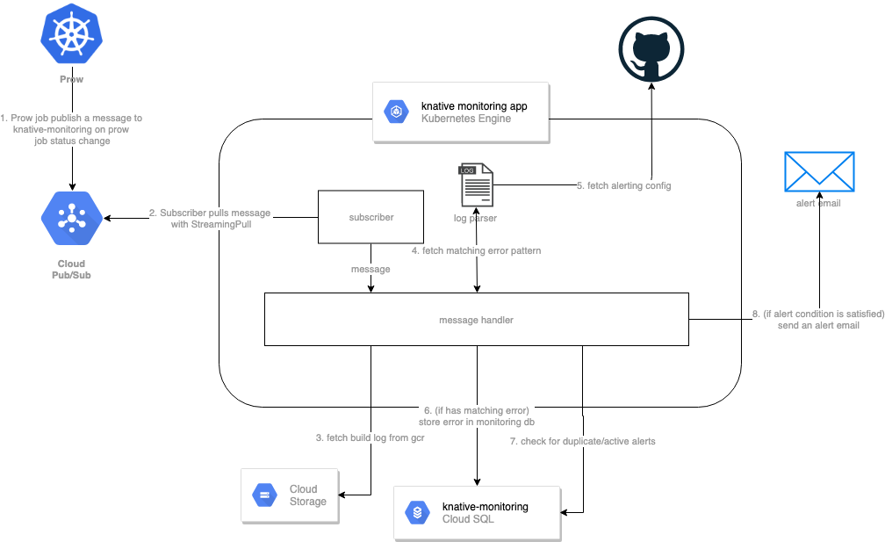

# Knative Monitoring

Knative monitoring is a service that listens to prow job pubsub messages. It
scrapes through all the failure logs to catch test infrastructure failures.

## System Diagram



## Setup

### Create the Cluster

```bash
gcloud container clusters create monitoring --enable-ip-alias --zone=us-central1-a
```

Note: The cluster connects to the CloudSQL instance via private IP. Thus, it is
required that the cluster is in the same zone as the CloudSQL instance.

## Build and Deploy Changes

### Update the Kubernetes components

[monitoring_service.yaml](https://github.com/knative/test-infra/blob/master/tools/monitoring/gke_deployment/monitoring_service.yaml)
is the config to set up all the Kubernetes resources. Use `kubectl apply` on the
monitoring_service file to make any updates.

### Update Image

1. Build and deploy the monitoring images.

   ```bash
   cd images/monitoring/
   make push
   ```

1. Update `tools/monitoring/gke_deployment/monitoring_service.yaml` to use the
   image tag created in previous step

1. Apply the changes to use the new image in production

   ```bash
   kubectl apply -f monitoring_service.yaml
   ```

### Clearing the alerts

From `tools/monitoring/clearalerts` directory, run `run_clear_alerts.sh` script.

Note: `run_clear_alerts.sh` only works on linux machine. It builds the binary on
the local machine and copies it to the monitoring pod. On MacOS, the binary it
built returns error `cannot execute binary file: Exec format error` when it runs
on the monitoring pod.
